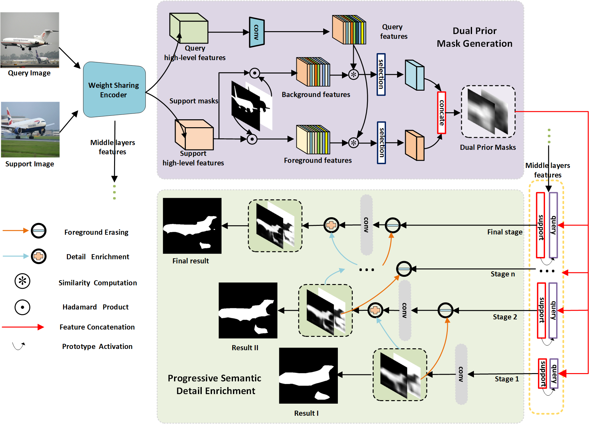

# Progressively-Dual-Prior-Guided-Few-shot-Semantic-Segmentation
Codes for progressive dual prior guided few-shot semantic segmentation.

the overall network:

some visualization results:
the overall network:

# Get Started

### Environment
+ torch==1.4.0 (torch version >= 1.0.1.post2 should be okay to run this repo)
+ numpy==1.18.4
+ tensorboardX==1.8
+ cv2==4.2.0

### Datasets and Data Preparation

We follow the dataset setting in **PMMs**: https://github.com/Yang-Bob/PMMs. 

The pretrained [**model**](https://pan.baidu.com/s/1qn_AhDbV5Q5XM-PpuKrNqQ) in **VOC_split0_1-shot** is provided as a sample. (Password:yd11)
